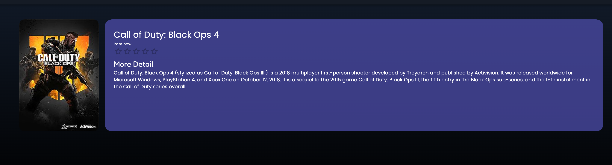
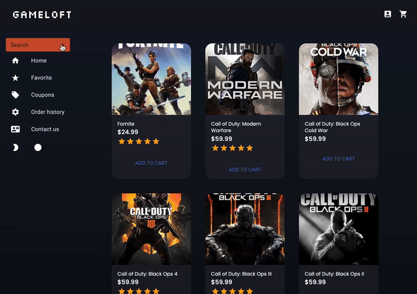

 
# GameLoft 

## Table of Contents

- [Installation](#installation)
- [Usage](#usage)
- [Highlighted Features](#highlighted-features)
- [Technologies Used](#technologies-used)
- [Learning Points](#learning-points)
- [License](#license)
- [Contributors](#contributors)
- [Authors](#author)

<br>

#### Web Application
**[Link to deployed Application](https://game-loft-5f74d9e2c208.herokuapp.com/)**

<br>

## Description

Welcome to GameLoft, where even the most ordinary games become thrilling adventures! In today's booming online business landscape, GameLoft strives to inject excitement into eCommerce. Our real-life application, developed using the MERN Stack, is a testament to this mission. Styled with Materialize UI, we add personality with emojis, ensuring an engaging user experience.

Our application boasts seamless online payments via Stripe, the industry's gold standard for secure transactions. We prioritize user security by employing bcrypt encryption to hash passwords, preventing unauthorized access. Bcrypt's advanced hashing algorithms are our frontline defense against modern hackers.

While our website is still undergoing development, the majority of its core functionalities are up and running. Join us as we continue to elevate gaming and eCommerce to new heights!


<br>


## Demo


<br>

**Home Page:** On the homepage, users will have access to the smart bar and the complete inventory of games in the store.


<br>


**Product's Detail:** (To go to product detail by simply just click on it) Here user can do things like rate the product and read more details about the products.



<br>

**Smart bar:** User could search for game by it name and seamlessly moving of different sections of the sidebar instead of scrolling 



<br>

## Highlighted Features

**Encrypt Password:** To secure user password we utilize Bcrypt npm package for harsh user password on for every user. 

```js

userSchema.pre('save', async function(next) {
  if (this.isNew || this.isModified('password')) {
    const saltRounds = 10;
    this.password = await bcrypt.hash(this.password, saltRounds);
  }

  next();
});

// compare the incoming password with the hashed password
userSchema.methods.isCorrectPassword = async function(password) {
  console.log('this.password', this.password);
  console.log('password', password)
  return await bcrypt.compare(password, this.password);
};
```

<br>


**Data Persistent**
<hr>
We want the shopper to have item saved in cart until checkout or delete from cart without having to readd to cart every time they close the window, to achieve this effect we utilize IndexDB

```js
export function idbPromise(storeName, method, object) {
  return new Promise((resolve, reject) => {
    const request = window.indexedDB.open('shop-shop', 1);
    let db, tx, store;
    request.onupgradeneeded = function(e) {
      const db = request.result;
      db.createObjectStore('products', { keyPath: '_id' });
      db.createObjectStore('categories', { keyPath: '_id' });
      db.createObjectStore('cart', { keyPath: '_id' });
    };

    request.onerror = function(e) {
      console.log('There was an error');
    };

    request.onsuccess = function(e) {
      db = request.result;
      tx = db.transaction(storeName, 'readwrite');
      store = tx.objectStore(storeName);

      db.onerror = function(e) {
        console.log('error', e);
      };

      switch (method) {
        case 'put':
          if (!object._id) {
            console.error('Object must have an _id property: ', object);
            return;  
          }
          store.put(object);
          resolve(object);
          break;
        case 'get':
          const all = store.getAll();
          all.onsuccess = function() {
            resolve(all.result);
          };
          break;
        case 'delete':
          store.delete(object._id);
          break;
        default:
          console.log('No valid method');
          break;
      }

      tx.oncomplete = function() {
        db.close();
      };
    };
  });
}
```

<br>

**Payment Handling**
<hr>

In order for Stripe to work we going to compose an object and fetch it with the API keys to to get back a session id. We then use this return session id to make the link to stripe with this link and redirect the user to it.

```js
    checkout: async (parent, args, context) => {
      const url = new URL(context.headers.referer).origin;
      await Order.create({ products: args.products.map(({ _id }) => _id) });
      const line_items = [];

      for (const product of args.products) {
        line_items.push({
          price_data: {
            currency: 'usd',
            product_data: {
              name: product.name,
              description: product.description,
              images: [`${url}/images/${product.image}`]
            },
            unit_amount: product.price * 100,
          },
          quantity: product.purchaseQuantity ,
        });
      }

      const session = await stripe.checkout.sessions.create({
        payment_method_types: ['card'],
        line_items,
        mode: 'payment',
        success_url: `${url}/success?session_id={CHECKOUT_SESSION_ID}`,
        cancel_url: `${url}/`,
      });
      return { session: session.id };
    },
```

<br>


### Installation
<hr>

*Please follows these steps to get the application up and running.
Be aware the application database is set up with mongoDB, you must have mongoDB Compass set up for it to work.*


- First you open the application with VSCODE
- Then open the command line to install all dependencies, type

```
 run: npm install
```

- then you get our data into your database you doing run this in the command line

```
run: npm run seed
```
- Then to get the app start up, in the command line run this 
```
npm run develop
```


<br>


### Learning Points
<hr>
Building a E-commerce platform with MERN Stack and implemented transaction ability to a online web application

<br>


### Technologies Used
<hr>


### More Details 

Explore the documentation for the technologies used in this project:


- [npm](https://www.npmjs.com/) - Package manager for JavaScript
- [JavaScript](https://developer.mozilla.org/en-US/docs/Web/JavaScript) - Programming language for web development
- [@apollo/server](https://www.apollographql.com/docs/apollo-server/) - GraphQL server library for Node.js
- [bcrypt](https://www.npmjs.com/package/bcrypt) - Library for hashing passwords
- [express](https://expressjs.com/) - Web application framework for Node.js
- [graphql](https://graphql.org/) - Query language for APIs
- [jsonwebtoken](https://www.npmjs.com/package/jsonwebtoken) - JSON web token implementation
- [mongoose](https://www.npmjs.com/package/mongoose) - MongoDB object modeling for Node.js
- [Stripe API](https://stripe.com/docs) - Payment processing API
- [@apollo/client](https://www.apollographql.com/docs/react/) - GraphQL client for React applications
- [jwt-decode](https://www.npmjs.com/package/jwt-decode) - Library for decoding JWT tokens
- [react](https://react.dev/) - JavaScript library for building user interfaces
- [react-dom](https://www.npmjs.com/package/react-dom) - DOM-specific methods for React
- [react-router-dom](https://www.npmjs.com/package/react-router-dom) - React bindings for React Router
- [vitest](https://vitest.dev/) - Testing library for Vue.js
- [happy-dom](https://www.npmjs.com/package/happy-dom) - Library for creating a DOM-like environment
- [HTML](https://developer.mozilla.org/en-US/docs/Web/HTML) - Markup language for creating web pages
- [CSS](https://developer.mozilla.org/en-US/docs/Web/CSS) - Styling language for web pages
- [BootStrap](https://getbootstrap.com) - Front-end framework for web development
- [MUI](https://mui.com/) - React UI framework
- [TailWind](https://tailwindcss.com/) - Utility-first CSS framework
- [Unsplash API](https://unsplash.com/developers) - API for accessing high-quality images

<br>

## Contributors


**Anthony Nguyen**

 [Portfolio](https://main--kaleidoscopic-custard-680b35.netlify.app/)

 [LinkedIn](https://www.linkedin.com/in/anthony-nguyen-32261526a/)

 [GitHub](https://github.com/Blackswan1010)

<hr>
 
**Andy Zurek**

[Portfolio](https://clinquant-sundae-c9bd6e.netlify.app/)

[LinkedIn](https://www.linkedin.com/in/andy-zurek-374bb9291/)

[GitHub](https://github.com/AZurek17)


<hr>


## Author

**Jay Nghiem**

[Portfolio](https://jstudio.tech)

[LinkedIn](https://www.linkedin.com/in/thai-nghiem-319292267/)
[GitHub](https://github.com/Truecoding4life)

## License

This project is licensed with MIT license

Link to License - [Website to MIT License](<(https://opensource.org/license/mit)>)

<!--   "postinstall": "npm run seed", -->